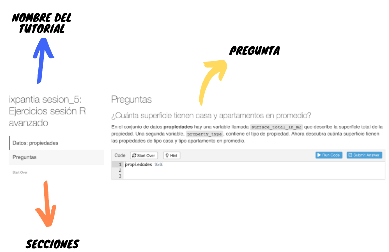

```{r, include = FALSE}
knitr::opts_chunk$set(
  collapse = TRUE,
  comment = "#>"
)
```

## Partes del tutorial 

Todos los tutoriales incluidos tienen una forma similar a la siguiente:



Las secciones se puede seleccionar directamente haciendo click sobre ellas o bien, al llegar al final de una se muestra un botón para pasar a la siguiente. La mayoría de preguntas incluidas son similares a la que se muestra arriba bajo la etiqueta de "pregunta". Hay dos variantes a este tipo de preguntas.

Una que incluye la opción de ver la solución y no se tiene que dar una respuesta definitiva


Y otra donde solo se puede ver una pista y si se debe dar la repuesta:

 

Para esto se usa el botón señalado con la etiqueta de "responder ejercicio".

En ambos casos tenemos un espacio donde podemos escribir código, un botón para correr ese código sin recibir retroalimentación y un botón para reiniciar el código que se escribe en el espacio designado.

